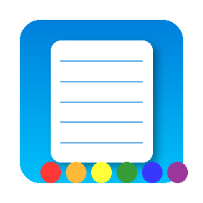
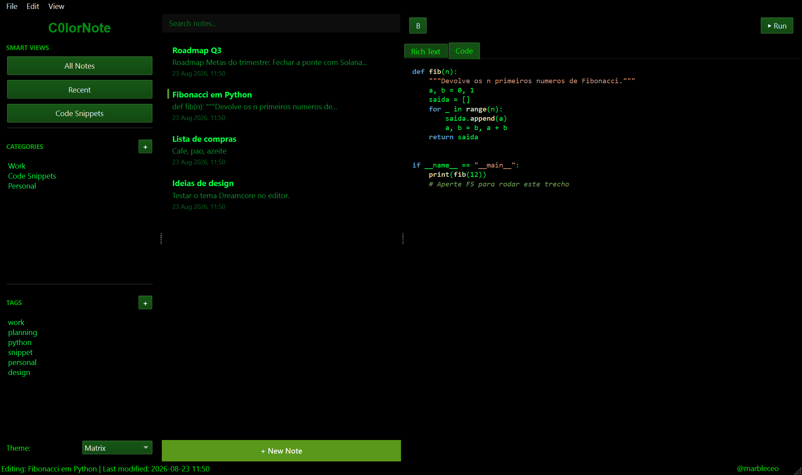
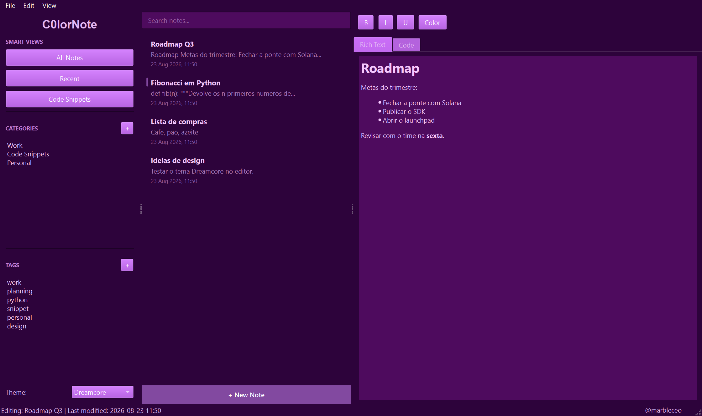
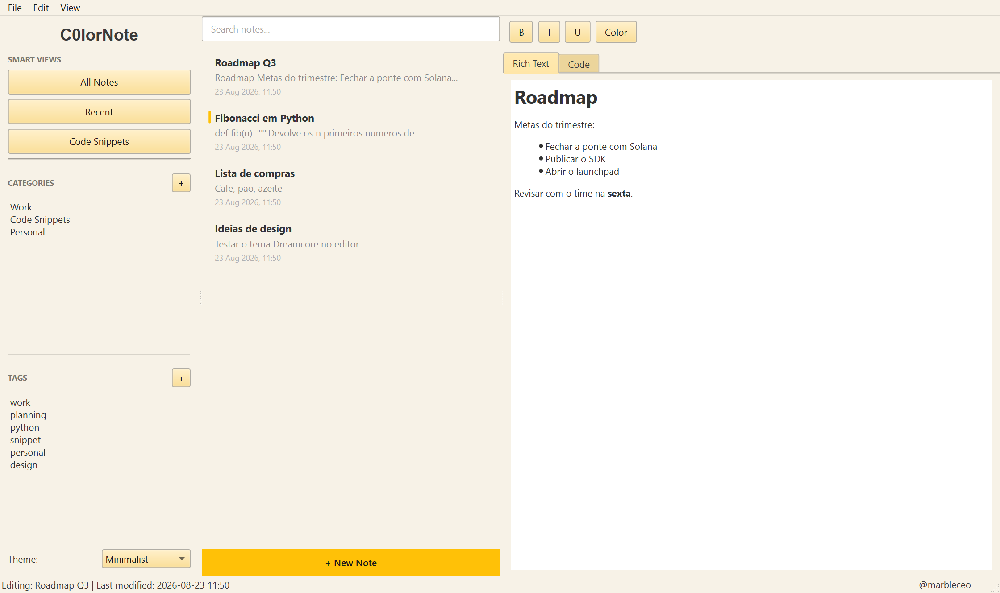
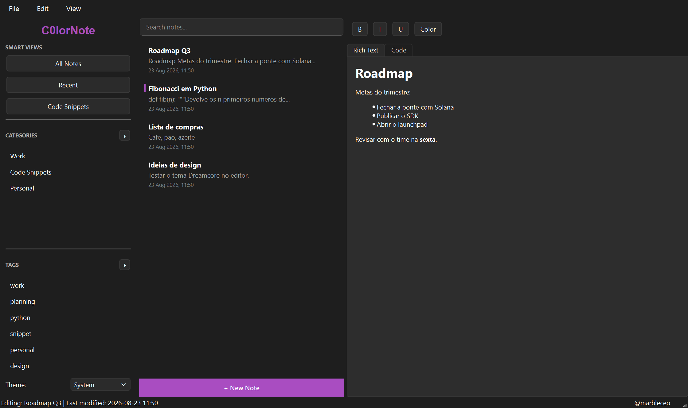

# 📝 C0lorNote

[](https://github.com/MarbleLabs1/C0lornote/releases/latest)
[](https://github.com/MarbleLabs1/C0lornote/actions/workflows/ci.yml)

**[Download for Windows](https://github.com/MarbleLabs1/C0lornote/releases/latest)** — one file, no Python needed. Or build from source below.

A modern note-taking application built with PyQt6, featuring rich text editing, code editing with syntax highlighting, and three beautiful themes. This completely redesigned version provides a sleek, responsive interface inspired by popular note apps like Notion, Google Keep, and Apple Notes.



## ✨ Features

C0lorNote has been completely rebuilt with PyQt6 to provide a modern, feature-rich experience:

- 🎨 **Four Themes**: Matrix (hacker-style), Dreamcore (surreal pastels), Minimalist (soft yellow), or **System** — which follows your operating system's own colours, including dark mode and your accent colour
- 📝 **Rich Text Editing**: Format text with bold, italic, underline, and custom colors
- 💻 **Code Editor**: Dedicated code environment with Python syntax highlighting
- 🏃 **Run Code**: Execute Python code snippets directly with F5 key
- 🔍 **Fast Search**: Instantly find notes as you type in the search bar
- 🏷️ **Organization**: Categorize and tag notes for easy filtering
- 🔄 **Smart Views**: Quickly access all notes, recent notes, or code snippets
- 📤 **Export Options**: Save notes as HTML, Python code, or plain text files
- 💾 **Auto-saving**: The open note is written to disk every 30 seconds, on <kbd>Ctrl</kbd>+<kbd>S</kbd>, when you switch notes and on exit
- 👤 **Branded UI**: Includes subtle @marbleceo branding in the status bar.

## 🎭 Themes

### 🖥️ Matrix Theme
A hacker-inspired theme with bright green text on black backgrounds. Perfect for coding sessions and creating a cyberpunk atmosphere while taking notes.

### 🌈 Dreamcore Theme
A surreal theme with deep purples and vibrant pinks that creates a creative, dreamy environment for your notes. Ideal for brainstorming and artistic projects.

### 🌞 Minimalist Theme
A clean, distraction-free theme with soft yellow accents on a light background. Great for everyday note-taking and focused writing.

## 📸 Screenshots

### Matrix

Neon green on black, with Python syntax highlighting in the code editor.
Press <kbd>F5</kbd> to run the snippet.



### Dreamcore

Deep purples and pinks, rich text editing with headings, lists and bold.



### Minimalist

Light and quiet, for distraction-free writing.



### System

Follows the operating system: the platform's own widget style, its light or
dark mode, and the accent colour you picked. On Windows it looks like a
Windows app; on Linux it follows your desktop.



## 📋 Requirements

- Python 3.9 or newer
- PyQt6 (graphical interface)
- SQLAlchemy (note storage)
- PyYAML (configuration)

All of them are installed by `pip install -r requirements.txt`.

## 🚀 Installation

### Using Virtual Environment (Recommended)

```bash
# Clone the repository (if you haven't already)
git clone https://github.com/MarbleLabs1/C0lornote.git
cd C0lornote

# Create a virtual environment
python -m venv venv

# Activate the virtual environment
# On Linux/macOS:
source venv/bin/activate
# On Windows:
# venv\Scripts\activate

# Install the dependencies
pip install -r requirements.txt

# Run the application
python run.py
```

### Creating a Desktop Entry (Linux)

To launch C0lorNote like any other desktop application:

```bash
# Create the desktop entry file
cat > ~/.local/share/applications/c0lornote.desktop << EOF
[Desktop Entry]
Name=C0lorNote
Comment=A modern note-taking application
Exec=/path/to/your/venv/bin/python /path/to/your/C0lornote/run.py
Icon=/path/to/your/c0lornote/assets/c0lornote.png
Terminal=false
Type=Application
Categories=Utility;TextEditor;
StartupNotify=true
EOF

# Update desktop database
update-desktop-database ~/.local/share/applications
```

## 🖱️ Usage

### Basic Operations

- **Create a Note**: Click the "+ New Note" button in the note list panel
- **Save a Note**: Press Ctrl+S or use File > Save (auto-saving is also enabled)
- **Delete a Note**: Select the note and press Delete or use Edit > Delete Note
- **Export a Note**: Use File > Export Note to save as HTML, Python, or text

### Keyboard Shortcuts

| Shortcut | Action |
|----------|--------|
| Ctrl+N | Create new note |
| Ctrl+S | Save current note |
| Ctrl+E | Export note |
| Delete | Delete selected note |
| F5 | Run code (in code editor) |
| Ctrl+B | Bold text |
| Ctrl+I | Italic text |
| Ctrl+U | Underline text |
| Ctrl+F | Focus search bar |

### Rich Text Editing

1. Select the "Rich Text" tab in the editor
2. Use the formatting toolbar to apply:
   - Bold, italic, or underline formatting
   - Text colors
   - Other formatting options

### Code Editing & Execution

1. Select the "Code" tab in the editor
2. Write Python code with syntax highlighting
3. Press F5 or click the "Run" button to execute
4. View the output in a popup dialog

## 📂 Organization

C0lorNote provides powerful organization features to keep your notes structured:

### Categories

- Create categories for broad organization (e.g., Work, Personal, Projects)
- Click the "+" button in the Categories section to add a new category
- Assign categories when creating notes
- Filter notes by clicking on a category in the sidebar

### Tags

- Add multiple tags to notes for cross-category organization
- Create tags by clicking the "+" in the Tags section
- Add comma-separated tags when creating or editing notes
- Filter notes by clicking on a tag in the sidebar

### Smart Views

Access quick filters for your notes:
- **All Notes**: View all your notes
- **Recent**: Show notes modified in the last 7 days
- **Code Snippets**: Show only notes containing code

## 🗂️ Project structure

```
C0lornote/
├── run.py                  # launcher: checks dependencies and starts the app
├── src/
│   ├── main.py             # entry point (QApplication + MainWindow)
│   ├── config/settings.py  # configuration file (YAML)
│   ├── models/
│   │   ├── note.py         # Note model
│   │   └── storage.py      # SQLite persistence (SQLAlchemy)
│   ├── ui/
│   │   ├── main_window.py  # main window and orchestration
│   │   ├── sidebar.py      # smart views, categories, tags, theme picker
│   │   ├── note_list.py    # note list with search and filters
│   │   ├── editor.py       # rich text editor + code editor
│   │   ├── highlighter.py  # Python syntax highlighting
│   │   └── theme.py        # the three themes
│   └── utils/logger.py     # logging
├── tests/test_smoke.py     # smoke tests (run headless)
└── debian/                 # .deb packaging
```

## 💾 Where your notes live

Notes are stored in a SQLite database at:

```
~/.config/c0lornote/notes.db
```

If you used an older version that saved to `notes.json`, that file is imported
automatically on first launch and renamed to `notes.json.migrated`. Nothing is
lost.

## 🧪 Tests

```bash
python tests/test_smoke.py     # no pytest needed
pytest tests/                  # or with pytest
```

The tests run with the Qt "offscreen" platform, so no window opens and they
work in CI.

## 📄 License

Copyright (c) 2026 MarbleCeo. **All rights reserved.**

The source code is public for reading, but copying, redistribution, modification
and commercial use require written permission. See [LICENSE](LICENSE) for the
full terms.

Earlier releases of this project were published under the MIT License; that
grant remains valid for the versions distributed at the time.

## 🤝 Contributing

Bug reports and suggestions are welcome via [issues](https://github.com/MarbleLabs1/C0lornote/issues).

Because this project is under a proprietary license, pull requests are accepted only by prior arrangement — open an issue first.

---

<p align="center">Made with ❤️ for the Linux community</p>
